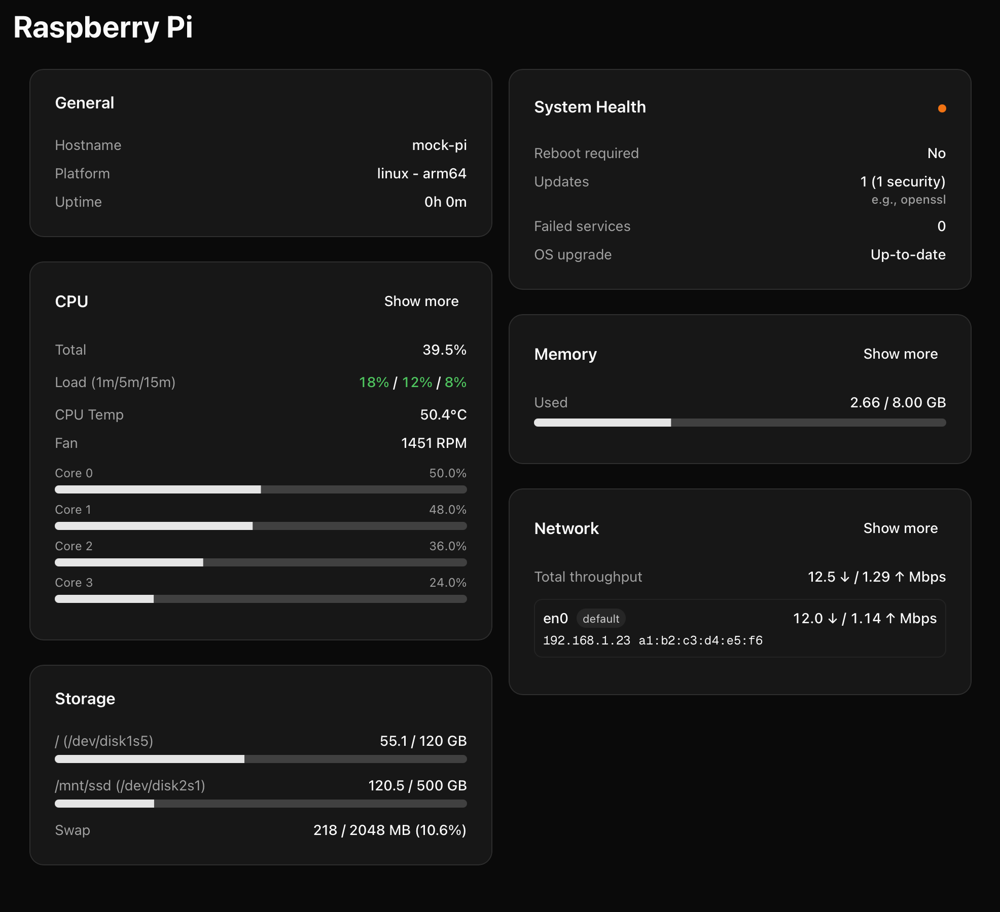

# pi-stats

Self-hosted system monitoring dashboard for Raspberry Pi.



Inspired by [pi-course.dev](https://www.picourse.dev/), pi-stats is a
lightweight, privacy-respecting monitoring dashboard built to run 24/7
on your Raspberry Pi or any other Linux host. It's designed to be
self-contained, simple to deploy, and fun to hack on.

## Overview

pi-stats gives you a live, local view of your Raspberry Pi's
performance---CPU load, memory usage, disk space, network throughput,
temperature, and more. It's built for Pi hardware but works great on any
Linux machine.

The app runs as a single Docker container, exposing a Next.js web
dashboard with zero external dependencies. It reads directly from `/sys`
and `/proc`, so all your system data stays on your device.

Key principles:

- Lightweight and privacy-respecting --- no cloud connections.
- Self-contained --- all in one Next.js app.
- Runs in Docker or standalone Node.js.
- Built for Raspberry Pi, works on any Linux host.

## Features

- Real-time system monitoring (CPU, memory, disk, network,
    temperature, fan, etc.)
- Auto-refresh UI built with Next.js and SWR
- Host-scope monitoring via Docker (`network_mode: host`)
- Clean modular dashboard: General, System Health, Memory, CPU, Storage, Network cards
- Mock mode for local development
- Standalone Docker image build

## Installation

### Option 1: Docker (recommended)

The easiest way to get started is with Docker Compose:

``` bash
docker compose up -d
```

This repository already includes a ready-to-use `docker-compose.yml` with host networking, read-only `/sys` and `/proc` mounts, and a healthcheck—just run the command above.

### Option 2: Manual / Dev setup

You can also run pi-stats directly on your machine for development:

``` bash
npm install
MOCK=true npm run dev
```

Then visit <http://localhost:3000> in your browser.

## Configuration

pi-stats supports a few environment variables to customize behavior:

  Variable      Description
  ------------- --------------------------------------------------------
  `MOCK`        Set to `1` to enable mock data (useful for local dev)
  `PORT`        Port the app listens on (default: `3000`)
  `HOST`        Host binding address (default: `0.0.0.0`)
  `HOST_PROC`   Optional: path to host `/proc` when mounted separately

When `MOCK=1`, all metrics are generated in-memory so you can test the
UI without hardware access.
